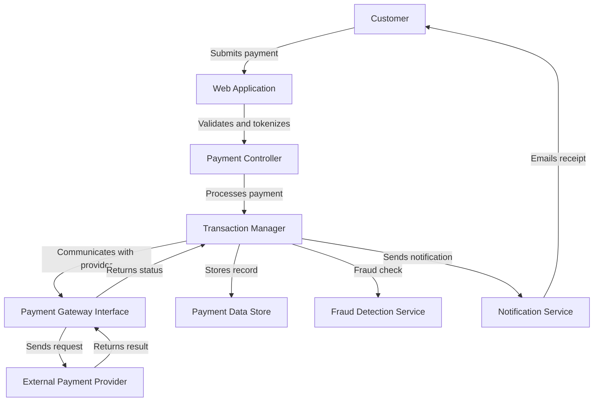

# Standard Documentation Rules

## Purpose

These rules establish balanced documentation requirements for professional projects and team environments. They ensure adequate documentation coverage for all significant components while maintaining a reasonable balance between documentation effort and development velocity. This standard is suitable for most professional software projects.

## Requirements

### Project Documentation

1. **README Requirements**
   - Project must include a comprehensive README.md with:
     - Project name, purpose, and business context
     - Detailed setup/installation instructions
     - Usage examples covering common scenarios
     - Complete dependencies list with version requirements
     - Contribution guidelines
     - License information
     - Contact information for maintainers

2. **Architecture Documentation**
   - Project must include basic architecture documentation:
     - High-level system design
     - Component interaction diagrams
     - Data flow diagrams
     - Key design decisions and rationales

3. **API Documentation**
   - All APIs must be fully documented:
     - Purpose and context of the API
     - Complete parameter descriptions with types and constraints
     - Return values and error conditions
     - Rate limits or performance considerations
     - Authentication requirements
     - Example requests and responses
     - Versioning information

### Code Documentation

1. **File Headers**
   - All source code files must include a header with:
     - Brief description of the file's purpose
     - Copyright information
     - Author(s)
     - Creation date
     - Last modification date

2. **Class/Module Documentation**
   - All classes/modules must be documented with:
     - Purpose and responsibilities
     - Usage context
     - Dependencies and relationships with other components
     - Examples of common usage patterns

3. **Function/Method Documentation**
   - All public functions/methods must be documented with:
     - Purpose and behavior
     - Parameters with types, constraints, and default values
     - Return values and types
     - Exceptions/errors that may be thrown
     - Side effects
     - Examples for complex functions

4. **Code Commenting Requirements**
   - Comments required for:
     - Complex logic sections
     - Business rules implementation
     - Performance-critical code
     - Workarounds with explanations
     - Non-obvious design decisions
     - Algorithm implementations

5. **Documentation Format**
   - Use consistent documentation formats for the language (e.g., JSDoc, docstrings, XML comments)
   - Follow a standardized structure within each documentation block
   - Include proper Markdown formatting where appropriate

6. **Naming Conventions**
   - Use descriptive, consistent naming for all code elements
   - Follow language-specific naming conventions
   - Use domain terminology appropriately and consistently

### Process Documentation

1. **Development Workflow**
   - Document the development workflow including:
     - Branch management strategy
     - Code review process
     - Testing requirements
     - Release process

2. **Environment Setup**
   - Document environment setup procedures:
     - Development environment setup
     - Testing environment configuration
     - Production deployment requirements

3. **Testing Guidelines**
   - Document testing approach:
     - Unit testing practices
     - Integration testing approach
     - Test data management
     - Coverage requirements

## Maintenance Requirements

1. **Documentation Updates**
   - Documentation must be updated when:
     - Adding new features
     - Changing existing functionality
     - Fixing bugs with behavior implications
     - Refactoring with architectural impact
     - Changing dependencies

2. **Documentation Review**
   - Documentation should be reviewed as part of the code review process
   - Technical writers or documentation specialists should review significant changes

3. **Documentation Versioning**
   - Major documentation changes should be versioned alongside code
   - Historical documentation should be preserved for reference

## Best Practices

1. **Documentation Planning**
   - Plan documentation needs during feature planning
   - Allocate appropriate time for documentation tasks
   - Consider documentation impact when estimating work

2. **Audience Awareness**
   - Tailor documentation to its intended audience
   - Consider experience levels and background knowledge
   - Provide both high-level overviews and detailed information

3. **Visual Elements**
   - Use diagrams, flowcharts, and screenshots where they enhance understanding
   - Maintain consistency in visual style
   - Keep visuals up-to-date with code changes

4. **Documentation Accessibility**
   - Ensure documentation is easily discoverable
   - Organize documentation logically
   - Use cross-references and links between related documents

5. **Tool Integration**
   - Leverage documentation generation tools
   - Integrate documentation into IDEs and workflow tools
   - Automate documentation checks where possible

## Examples

### Good Class Documentation Example

```java
/**
 * Manages user authentication and session handling for the application.
 * <p>
 * The UserAuthManager is responsible for authenticating users against the 
 * database, creating and validating session tokens, and handling login/logout
 * operations. It implements security best practices including password hashing,
 * rate limiting, and session timeout.
 * <p>
 * This class is thread-safe and can be used as a singleton.
 * 
 * @author Jane Smith
 * @since 1.2.0
 */
public class UserAuthManager {
    // Implementation
}
```

### Good Method Documentation Example

```javascript
/**
 * Processes a payment transaction using the specified payment provider.
 * 
 * This method handles the complete payment flow including validation,
 * processing, and recording the transaction. It communicates with the
 * payment gateway and handles error conditions appropriately.
 * 
 * @param {Object} paymentDetails - The payment details
 * @param {string} paymentDetails.amount - The payment amount (decimal string)
 * @param {string} paymentDetails.currency - The 3-letter currency code (e.g., "USD")
 * @param {string} paymentDetails.cardToken - The tokenized card information
 * @param {string} paymentDetails.customerId - The customer's unique identifier
 * @param {Object} [options] - Optional configuration for the payment
 * @param {boolean} [options.captureImmediately=true] - Whether to capture the payment immediately
 * @param {string} [options.provider="default"] - The payment provider to use
 * 
 * @returns {Promise<Object>} A promise that resolves to the transaction result
 * @throws {ValidationError} If the payment details are invalid
 * @throws {PaymentGatewayError} If the payment provider returns an error
 * @throws {DatabaseError} If the transaction cannot be recorded
 * 
 * @example
 * // Process a standard payment
 * const result = await processPayment({
 *   amount: "99.95",
 *   currency: "USD",
 *   cardToken: "tok_visa_4242",
 *   customerId: "cust_123456"
 * });
 * 
 * // Process with custom options
 * const result = await processPayment({
 *   amount: "99.95",
 *   currency: "EUR",
 *   cardToken: "tok_visa_4242",
 *   customerId: "cust_123456"
 * }, {
 *   captureImmediately: false,
 *   provider: "stripe"
 * });
 */
async function processPayment(paymentDetails, options = {}) {
    // Implementation
}
```

### Good Architecture Documentation Example

```markdown
# Payment Processing Architecture

## Overview

The payment processing system handles all financial transactions in the application.
It is designed to be secure, reliable, and extensible to support multiple payment
providers. The system follows PCI-DSS compliance requirements and implements 
industry best practices for financial data security.

## Components

1. **Payment Gateway Interface**: Abstracts communication with various payment providers
2. **Transaction Manager**: Handles the lifecycle of payment transactions
3. **Fraud Detection Service**: Evaluates transactions for potential fraud
4. **Payment Data Store**: Securely stores transaction records
5. **Notification Service**: Sends payment notifications to users and administrators

## Data Flow



## Key Design Decisions

1. **Tokenization**: We use tokenization to ensure no sensitive payment data is stored in our systems
2. **Provider Abstraction**: The gateway interface allows easy integration of new payment providers
3. **Asynchronous Processing**: Long-running operations use queues to ensure reliability
4. **Idempotency**: All payment operations are idempotent to prevent duplicate transactions
