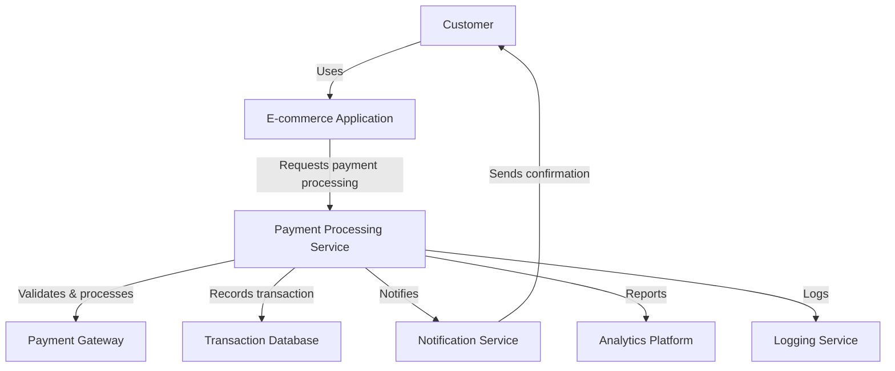
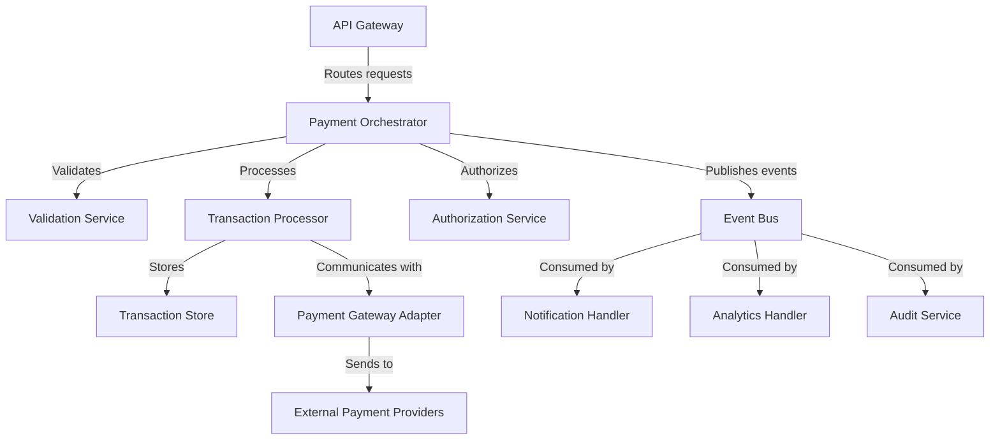
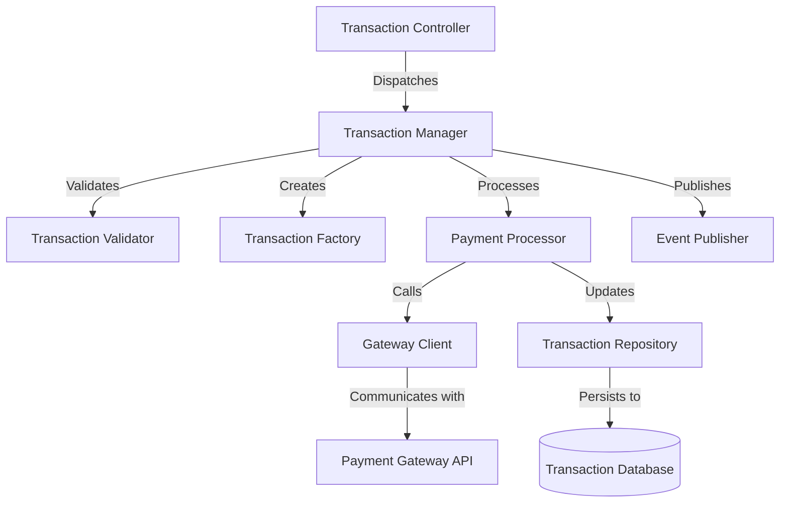
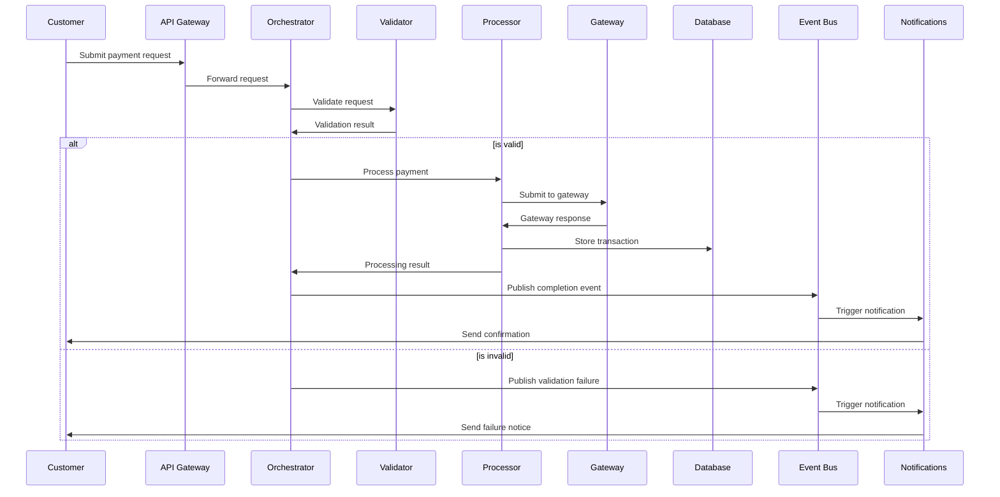
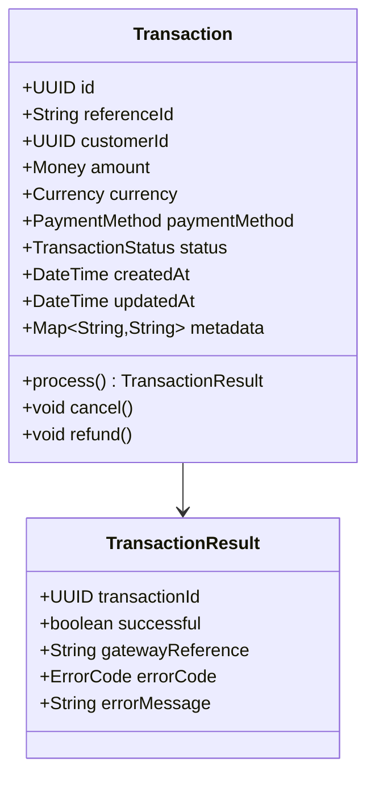
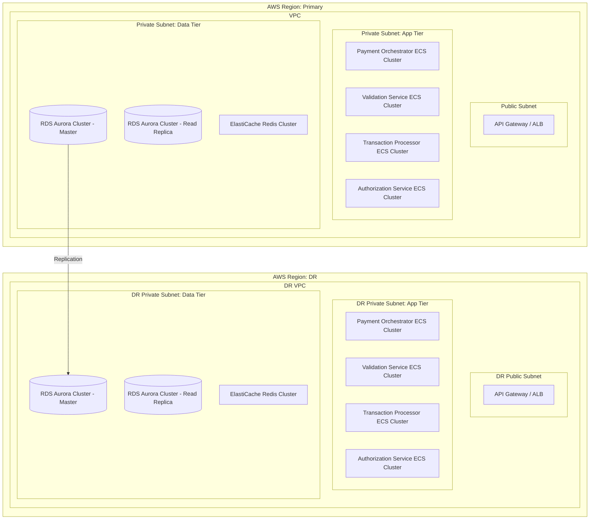

# Strict Documentation Rules

## Purpose

These rules establish rigorous and comprehensive documentation requirements for critical systems, regulated environments, public-facing projects, and situations where documentation completeness is essential. This standard mandates thorough, precise documentation at all levels with formal processes for creation, review, and maintenance.

## Requirements

### Project Documentation

1. **Comprehensive README Requirements**
   - Project must include an extensive README.md with:
     - Executive summary of project purpose and scope
     - Detailed project description and business context
     - Comprehensive installation guide for all supported environments
     - Step-by-step setup instructions with troubleshooting guidance
     - Complete usage documentation with examples for all features
     - Full API reference or links to detailed API documentation
     - Comprehensive list of dependencies with version requirements and licensing
     - Detailed contribution guidelines with code standards
     - Security policy and vulnerability reporting process
     - Detailed release notes and version history
     - Support information and escalation path
     - License and legal information

2. **Architecture Documentation**
   - Must include comprehensive architecture documentation:
     - System context diagram
     - Container diagrams showing system components
     - Component diagrams showing internal structures
     - Detailed data flow diagrams for all processes
     - Sequence diagrams for all major interactions
     - State diagrams for complex state machines
     - Technology stack documentation
     - Architecture decision records (ADRs) for all key decisions
     - Deployment architecture diagrams
     - Security architecture documentation
     - Performance and scalability considerations

3. **Technical Specification**
   - Detailed technical specification including:
     - Functional requirements with traceability
     - Non-functional requirements with verification methods
     - System constraints and limitations
     - External system interfaces
     - Data models and schemas
     - Error handling strategy
     - Logging and monitoring approach
     - Internationalization and localization specifications
     - Accessibility compliance documentation

4. **API Documentation**
   - Comprehensive API documentation including:
     - Purpose, context and scope of each API
     - Complete and formal interface definitions (e.g., OpenAPI/Swagger)
     - Detailed endpoint descriptions with URI templates
     - Request and response formats with schema definitions
     - Authentication and authorization requirements
     - Complete parameter descriptions with types, constraints, and validation rules
     - All possible response codes and error conditions with handling guidance
     - Rate limits, quotas, and throttling behavior
     - Performance characteristics and SLAs
     - Versioning policy and backward compatibility guarantees
     - Deprecation policy and timelines
     - Multiple, real-world examples for each endpoint
     - SDK usage examples in multiple languages where applicable
     - Postman collections or equivalent for testing

### Code Documentation

1. **File Headers**
   - All source code files must include a standardized header with:
     - Copyright notice and license information
     - File name and purpose
     - Module/package affiliation
     - Author(s) with contact information
     - Creation date
     - Modification history with dates and authors
     - Related files or dependencies
     - Any applicable standards or regulations

2. **Class/Module Documentation**
   - All classes/modules must have comprehensive documentation including:
     - Purpose and responsibilities
     - Design patterns used
     - Inheritance hierarchy and interfaces implemented
     - Thread safety guarantees
     - State management approach
     - Performance characteristics
     - Memory usage considerations
     - Lifecycle information (initialization, cleanup)
     - Extension points
     - Usage restrictions or limitations
     - Multiple usage examples
     - Unit test coverage information

3. **Function/Method Documentation**
   - All functions and methods (public, protected, and non-trivial private) must include:
     - Detailed purpose description
     - Contract conditions (pre-conditions, post-conditions, invariants)
     - Comprehensive parameter documentation with types, units, ranges, validation rules
     - Return value documentation with all possible values and conditions
     - All exceptions and error conditions with handling guidance
     - Side effects and state changes
     - Thread safety considerations
     - Performance characteristics for critical paths
     - Memory usage for resource-intensive operations
     - Algorithm explanation for complex implementations
     - Examples covering normal cases, edge cases, and error cases
     - References to relevant requirements or design documents

4. **Code Commenting**
   - Inline comments required for:
     - All non-obvious code sections
     - Complex algorithms with step-by-step explanation
     - Performance optimizations with benchmarks
     - Workarounds with issue references
     - Business rules implementation with requirements traceability
     - Security-sensitive sections with risk assessment
     - Asynchronous or concurrent code with race condition analysis
     - Resource management with cleanup guarantees
     - Platform-specific code with compatibility notes

5. **Documentation Tools and Format**
   - Must use standardized documentation tools appropriate for the language
   - Must follow a consistent, defined structure for all documentation
   - Must use formal specification language where appropriate (e.g., JSDoc, Javadoc, docstrings)
   - Must include type information for all languages
   - Must use consistent terminology throughout
   - Documentation must be linted and verified for completeness
   - Generated documentation must be part of the build process

### Process Documentation

1. **Development Process**
   - Comprehensive documentation of development processes:
     - Detailed git workflow with branch naming conventions
     - Commit message format and requirements
     - Code review process and checklist
     - Pull/merge request templates and process
     - CI/CD pipeline documentation
     - Release management process
     - Hotfix process
     - Emergency procedure documentation

2. **Testing Documentation**
   - Thorough testing documentation including:
     - Test strategy document
     - Test plans for all features
     - Test case specifications with scenarios
     - Test data management approach
     - Unit testing standards and practices
     - Integration testing approach
     - System testing methodology
     - Performance testing methodology
     - Security testing approach
     - Acceptance criteria for all requirements
     - Regression testing strategy
     - Test environment specifications
     - Test coverage requirements and metrics

3. **Operational Documentation**
   - Complete operational documentation including:
     - System deployment guides
     - Configuration management documentation
     - Environment setup procedures
     - Backup and recovery procedures
     - Monitoring and alerting documentation
     - Incident response procedures
     - Disaster recovery plan
     - Production support guide
     - Performance tuning guide
     - Troubleshooting guide with common issues
     - Maintenance procedures and schedules
     - Capacity planning guidance

## Documentation Management

### Version Control and History

1. **Version Management**
   - All documentation must be version controlled
   - Documentation versions must align with code versions
   - Major documentation changes require formal review and approval
   - Documentation history must be maintained with change reasons
   - Previous versions must remain accessible with clear versioning

2. **Change Tracking**
   - All documentation changes must be traceable to requirements or issues
   - Significant documentation changes require change log entries
   - Documentation updates must be part of definition of done
   - Documentation gaps must be tracked and addressed

### Review and Approval

1. **Review Process**
   - All documentation must undergo formal review
   - Technical reviews by subject matter experts required
   - Readability reviews by potential users required
   - Accuracy reviews against implementation required
   - Security reviews for sensitive documentation required

2. **Approval Requirements**
   - Technical documentation requires technical lead approval
   - Architecture documentation requires architect approval
   - User-facing documentation requires product manager approval
   - Documentation for regulated features requires compliance approval
   - Documentation for critical components requires multiple approvals

### Maintenance Process

1. **Regular Updates**
   - Documentation must be updated in sync with code
   - Documentation audit required for each major release
   - Periodic reviews required even without code changes
   - Documentation metrics must be tracked (coverage, quality, feedback)
   - Documentation improvement plan must be maintained

2. **Ownership and Responsibility**
   - Each document must have a designated owner
   - Documentation responsibilities must be clearly assigned
   - Authors must be identified for accountability
   - Technical writers must be involved for critical documentation
   - Knowledge transfer process must be documented for team changes

## Formats and Structure

### Format Requirements

1. **Standard Formats**
   - Technical documentation must use Markdown or equivalent
   - API documentation must use standardized formats (OpenAPI, etc.)
   - Architecture documentation must use standardized notation (UML, C4, etc.)
   - Documentation must be accessible in both source and rendered forms
   - Documentation must be printable where required for compliance

2. **Structure Requirements**
   - Each document must have a consistent structure
   - Documents must include table of contents for navigability
   - Section numbering must be used for reference
   - Cross-references must be maintained between documents
   - Glossary of terms must be maintained

### Organization Requirements

1. **Repository Organization**
   - Documentation must be organized in a defined structure
   - Main project documentation must be in designated locations
   - Cross-cutting concerns must have dedicated documentation
   - Navigation aids must be provided
   - Search capability must be available

2. **Discoverability**
   - Documentation index must be maintained
   - Documentation must be categorized and tagged
   - Related documentation must be cross-linked
   - Documentation must be searchable with appropriate metadata
   - Entry points must be clear for different user types

## Quality Standards

### Readability Requirements

1. **Style Guidelines**
   - Documentation must follow a defined style guide
   - Language must be clear, concise, and precise
   - Active voice must be used when possible
   - Technical terminology must be used consistently
   - Acronyms and abbreviations must be defined at first use

2. **Audience Focus**
   - Documentation must identify target audience
   - Content must be appropriate for audience expertise level
   - Examples must be relevant to audience use cases
   - Multiple audience needs must be addressed with appropriate sections
   - Navigation must allow different audiences to find relevant content

### Verification and Testing

1. **Documentation Testing**
   - Instructions and procedures must be tested by following them
   - Code examples must be tested to ensure they work as documented
   - API documentation must be tested against actual API behavior
   - Screenshots and diagrams must be verified for accuracy
   - Links and references must be validated

2. **Quality Metrics**
   - Documentation completeness must be measured and reported
   - User feedback must be collected and addressed
   - Documentation issues must be tracked and resolved
   - Documentation quality must be part of release criteria
   - Documentation debt must be tracked like technical debt

## Examples

### Architecture Documentation Example

```markdown
# Payment Processing Service Architecture

## System Context

The Payment Processing Service operates within the following system context:



## Container Diagram

The Payment Processing Service consists of the following containers:



## Component Diagram: Transaction Processor

The Transaction Processor container consists of these components:



## Critical Flows

### Payment Processing Sequence



## Data Model

### Transaction Entity



## Security Architecture

### Authentication and Authorization

The Payment Processing Service implements the following security measures:

1. **API Authentication**:
   - OAuth 2.0 with JWT tokens
   - Mutual TLS for service-to-service communication
   - API keys for partner integrations

2. **Authorization Model**:
   - Role-based access control with the following roles:
     - `payment.read`: Can view transaction details
     - `payment.process`: Can initiate new transactions
     - `payment.refund`: Can issue refunds
     - `payment.admin`: Can manage configurations

3. **Data Security**:
   - All PII and card data is encrypted at rest using AES-256
   - Sensitive data in transit is protected with TLS 1.3
   - Payment card data is tokenized and never stored directly
   - Encryption keys are rotated quarterly using automated key management

## Performance Characteristics

### Throughput and Latency

The service is designed to handle the following performance requirements:

- **Peak throughput**: 5,000 transactions per second
- **Average latency**: < 300ms for 95th percentile
- **Maximum latency**: < 1s for 99.9th percentile

Performance testing results from the most recent tests:

| Scenario | Load | Avg. Latency | 95th % | 99th % | Error Rate |
|----------|------|--------------|--------|--------|------------|
| Normal | 1,000 TPS | 120ms | 180ms | 220ms | 0.001% |
| Peak | 5,000 TPS | 250ms | 450ms | 800ms | 0.01% |
| Stress | 7,500 TPS | 400ms | 850ms | 1.2s | 0.1% |

## Deployment Architecture



## Architecture Decision Records

### ADR-001: Payment Gateway Abstraction Layer

**Status**: Accepted

**Context**: We need to integrate with multiple payment gateways to provide redundancy and support various payment methods.

**Decision**: Implement an abstraction layer using the Adapter pattern to decouple core payment processing from specific gateway implementations.

**Consequences**:
- Positive: Can add new gateways without changing core logic
- Positive: Can switch gateways for specific payments based on rules
- Negative: Adds complexity to the codebase
- Negative: Lowest common denominator effect for gateway-specific features

**Implementation Notes**: Each gateway adapter must implement the `PaymentGateway` interface and handle gateway-specific error mapping.
```

### Comprehensive Method Documentation Example

```java
/**
 * Processes a payment transaction through the specified payment gateway.
 * <p>
 * This method handles the entire payment processing flow including validation,
 * gateway communication, error handling, retry logic, and transaction recording.
 * It ensures that transactions are atomic and consistent even in the case of
 * partial failures by implementing a two-phase commit pattern with the
 * transaction database and payment gateway.
 * <p>
 * The method is idempotent and can be safely retried with the same transactionId
 * without resulting in duplicate charges. If a transaction with the given ID
 * already exists, the method will return the existing result rather than
 * processing again.
 * <p>
 * Performance note: This method typically completes in 300-500ms but may take
 * up to 2000ms during peak processing times or when gateway latency is high.
 * Callers should set appropriate timeouts.
 *
 * @param transactionRequest The payment transaction request containing all necessary
 *                          details for processing the payment. Must not be null.
 *                          All required fields must be populated according to the
 *                          {@link TransactionRequest} documentation.
 * @param gatewayType The payment gateway to use for processing. Must be one of
 *                   the supported gateways defined in {@link GatewayType}.
 *                   If null, the default gateway will be selected based on the
 *                   payment method and transaction properties.
 * @param options Additional processing options that modify the behavior of the
 *               payment processing. Optional, may be null to use default behavior.
 *               See {@link PaymentOptions} for available options.
 *
 * @return A {@link TransactionResult} object containing the complete result of
 *         the transaction, including gateway reference ID, status, and any
 *         error information. Never returns null.
 *
 * @throws ValidationException If the transaction request is invalid or missing
 *                            required fields. The exception will contain detailed
 *                            information about which validations failed.
 * @throws GatewayException If communication with the payment gateway fails or the
 *                         gateway returns an unrecoverable error. Contains the
 *                         specific gateway error code and message.
 * @throws PaymentDeclinedException If the payment was declined by the gateway or
 *                                 issuing bank. Contains the decline code and
 *                                 reason if available.
 * @throws DuplicateTransactionException If a transaction with the same external
 *                                      reference ID has already been processed
 *                                      and the current request differs from the
 *                                      original.
 * @throws SystemException If an unexpected internal error occurs during processing.
 *
 * @implNote This implementation uses the Strategy pattern to select the appropriate
 *          gateway handler, and a Circuit Breaker pattern to handle gateway outages.
 *          The method is annotated with @Transactional to ensure database consistency.
 *
 * @see TransactionRequest
 * @see GatewayType
 * @see PaymentOptions
 * @see TransactionResult
 *
 * @security This method requires the caller to have the 'payment.process' permission.
 *          All PAN data is tokenized before storage and all sensitive data is
 *          encrypted in logs.
 *
 * @example
 * // Process a simple credit card payment
 * try {
 *     TransactionRequest request = new TransactionRequest.Builder()
 *         .withAmount(new Money("99.95", Currency.USD))
 *         .withPaymentMethod(new CreditCardPaymentMethod("4111111111111111", "12/25", "123"))
 *         .withCustomerId("cust_12345")
 *         .withMerchantReference("order_8654")
 *         .build();
 *     
 *     TransactionResult result = paymentService.processTransaction(request, GatewayType.STRIPE, null);
 *     
 *     if (result.isSuccessful()) {
 *         // Handle successful payment
 *         String gatewayReference = result.getGatewayReference();
 *         // Store gateway reference with order
 *     } else {
 *         // Handle declined payment
 *         DeclineReason reason = result.getDeclineReason();
 *         // Inform user of decline reason
 *     }
 * } catch (ValidationException e) {
 *     // Handle validation errors
 *     List<ValidationError> errors = e.getValidationErrors();
 *     // Display errors to user
 * } catch (GatewayException e) {
 *     // Handle gateway communication errors
 *     // Typically retry or switch to backup gateway
 *     logFailure("Gateway error", e);
 *     switchToBackupGateway();
 * }
 *
 * // Process with advanced options
 * try {
 *     TransactionRequest request = new TransactionRequest.Builder()
 *         .withAmount(new Money("99.95", Currency.USD))
 *         .withPaymentMethod(new CreditCardPaymentMethod("4111111111111111", "12/25", "123"))
 *         .withCustomerId("cust_12345")
 *         .withMerchantReference("order_8654")
 *         .build();
 *     
 *     PaymentOptions options = new PaymentOptions.Builder()
 *         .withCapture(false) // Authorize only, capture later
 *         .withStatement("ACME Store Purchase") // Custom statement descriptor
 *         .withMetadata(Map.of("orderSystem", "ecommerce", "promotion", "SUMMER2025"))
 *         .withIdempotencyKey("idem_12345") // Custom idempotency key
 *         .withRetryCount(3) // Override default retry count
 *         .build();
 *     
 *     TransactionResult result = paymentService.processTransaction(
 *         request, GatewayType.STRIPE, options);
 *     
 *     // Process result as above
 * } catch (Exception e) {
 *     // Handle exceptions
 * }
 *
 * @since 2.0.0
 * @author Jane Smith
 * @version 2.3.1
 */
@Transactional
@Monitored(category = "payment", name = "process_transaction")
public TransactionResult processTransaction(
        @NotNull TransactionRequest transactionRequest,
        GatewayType gatewayType,
        @Nullable PaymentOptions options) throws ValidationException, GatewayException,
        PaymentDeclinedException, DuplicateTransactionException, SystemException {
    
    // Implementation would go here
}
